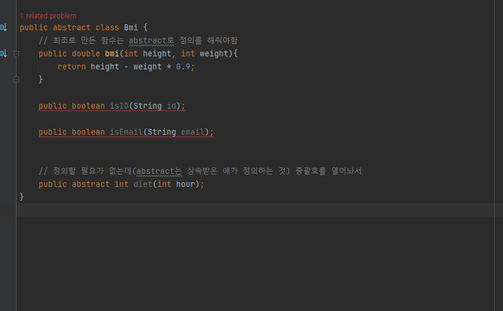

# Abstract

- 실제로 존재하지 않는 것 (스케치)

- public void  => man 에 

- 추상클래스: 개념만 있고 실제로 존재하지 않는 것. Object를 보유하지 않음 , 상속할 때 구조를 정의해주는 것

  - 일반적인 클래스를 보유 

  - EX. 마음 

- 인터페이스 : 클래스-클래스 간의 통신을 위해 만들어짐, 의사소통

  - 중간에서 연결
    - 소스 상: 클래스(객체를 생성해주는 것) - 클래스

- GUI : Graphic User Interface

  - UI 를 그림에 비쳐서 하는 것

- CUI: Character User Interface

  - UI 를 글자에 비쳐서 하는 것

- ex. 구글로그인 시, 
  - 아이디, 닉네임, 핸드폰번호, 이메일 중복 체크 등을 abstract로 정해놓음
  - 구글 아이디 받아서 회원가입해서 그냥 받을 수 있도록
  - 해야할 일들 abstract에 적어놓는 식 

##### 

- onCreate() 는 무조건 써야하는 구조라고 정의해 둔 것이 abstract 
- Activity도 onCreate()를 써야하므로 추상클래스임
  - onCreate() 안쓰면 동작 안하므로 
- Man에 Bmi 상속 받고, 오류난 것 고치기
- Man, Person 수정하기 (빨간줄)
- 추상 클래스는 메모리에 다 올라가는 게 아니라 일부만 올림 => 메서드 메모리에만 올라감, 나머지는 상속받는 애가 정의해줌 => 힙 메모리에 올라감

- 메서드/ 힙 메모리
- 인터페이스는 힙 메모리에 바로 올라감 

- 다른 클래스 생성자 만들고 , 상속받을 거 받고 ANIMAL FINAL 만들기